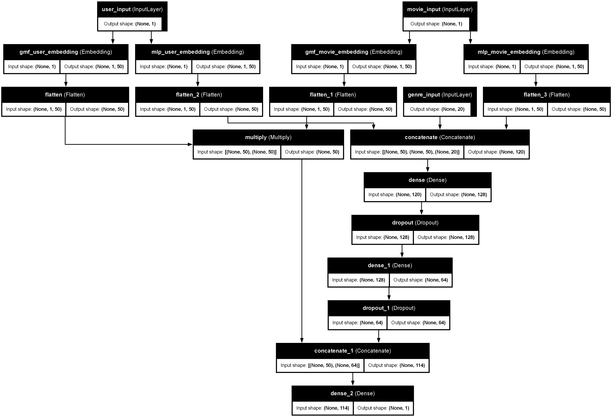

# Movie Recommendation System

<!-- ->> Replace with an actual image if available -->

A hybrid movie recommendation system that combines **Generalized Matrix Factorization (GMF)** and **Multi-Layer Perceptron (MLP)** to provide personalized movie recommendations. The system is deployed using **Render** and is available at [movierecommendation-system.onrender.com](https://movierecommendation-system.onrender.com/).

---

## Table of Contents
1. [Overview](#overview)
2. [Features](#features)
3. [File Structure](#file-structure)
4. [Setup](#setup)
5. [Usage](#usage)
6. [Deployment](#deployment)
7. [Evaluation](#evaluation)
8. [Contributing](#contributing)
9. [License](#license)
10. [Acknowledgments](#acknowledgments)
11. [Contact](#contact)

---

## Overview

This project is a movie recommendation system built using a hybrid model that combines GMF and MLP. It uses the **MovieLens dataset** to train the model and provides recommendations based on user input. The system is deployed as a web service using **Render**.

---

## Features

- **Hybrid Model**: Combines GMF and MLP for accurate recommendations.
- **User Input**: Users can input recently watched movies and their ratings.
- **Personalized Recommendations**: Provides top 10 movie recommendations based on user preferences.
- **Deployment**: Hosted on Render for easy access.

---

## File Structure
```
MovieRecommendation_System/
│
├── dataset/                     # Directory containing the MovieLens 100k dataset
│   └── movielens-32m/           # Subdirectory for the specific dataset
│       ├── link.csv             # CSV file containing movie links
│       ├── movies.csv           # CSV file containing movie details (title, genres, etc.)
│       ├── ratings.csv          # CSV file containing user ratings for movies
│       ├── tags.csv             # CSV file containing user-generated tags for movies
│       ├── README.txt           # Documentation for the dataset
│
│   └── movielens-100k/          # Subdirectory for the specific dataset
│       ├── link.csv             # CSV file containing movie links
│       ├── movies.csv           # CSV file containing movie details (title, genres, etc.)
│       ├── ratings.csv          # CSV file containing user ratings for movies
│       ├── tags.csv             # CSV file containing user-generated tags for movies
│       ├── README.txt           # Documentation for the dataset
│
├── preprocess.py                # Script for preprocessing the dataset
│
├── train.py                     # Script for training the recommendation model
│
├── model/                       # Directory containing the trained model and related files
│   └── movielens-32m/          # Subdirectory for the specific dataset's model
│       ├── best_model.keras     # Trained model saved in Keras format
│       ├── training_history.json # JSON file containing the training history
│       ├── model_architecture.png # Image file showing the model architecture
│       ├── training_history_plot.png # Plot of training and validation loss over epochs
│       └── predictions_vs_actual.png # Plot comparing predicted vs actual ratings
│
│   └── movielens-100k/          # Subdirectory for the specific dataset's model
│       ├── best_model.keras     # Trained model saved in Keras format
│       ├── training_history.json # JSON file containing the training history
│       ├── model_architecture.png # Image file showing the model architecture
│       ├── training_history_plot.png # Plot of training and validation loss over epochs
│       └── predictions_vs_actual.png # Plot comparing predicted vs actual ratings
│
├── evaluate.py                  # Script for evaluating the trained model
│
├── generate_recommendations.py  # Script for generating movie recommendations
│
├── app.py                       # Flask server script for hosting the recommendation system
│
├── static/                      # Directory for static files (CSS, JS)
│   └── styles.css               # CSS file for styling the frontend
│
├── templates/                   # Directory for HTML templates
│   └── index.html               # HTML template for the frontend
│
└── .env                         # Environment variables file for configuration
```

---

## Setup

### Prerequisites

- Python 3.8 or higher
- pip (Python package manager)

### Installation

1. Clone the repository:
   ```bash
   git clone https://github.com/SoudeepGhoshal/MovieRecommendation_System.git
   cd MovieRecommendation_System
   ```

2. Install the required dependencies:
   ```bash
   pip install -r requirements.txt
   ```

3. Set up environment variables:
   - Create a `.env` file in the root directory.
   - Add the following variables:
     ```ini
     DATASET = movielens-100k
     
     RATINGS_PATH = dataset/${DATASET}/ratings.csv
     MOVIES_PATH = dataset/${DATASET}/movies.csv
     PREPROCESSED_DATA_PATH = dataset/${DATASET}/preprocessed_data.pkl
     
     MODEL_PATH = model/${DATASET}/best_model.keras
     MODEL_ARCHITECTURE_PATH = model/${DATASET}/model_architecture.png
     TRAINING_HISTORY_PATH = model/${DATASET}/training_history.json
     PLOT_TRAINING_HISTORY_PATH = model/${DATASET}/training_history_plot.png
     PREDICTIONS_VS_ACTUAL_PATH = model/${DATASET}/predictions_vs_actual.png.png
     
     INDEX_PATH = 'index.html'
     ```

4. Download the **MovieLens-32M dataset** and place it in the `dataset/movielens-32m/` directory.
   [You may use any other version of the MovieLens dataset you want. MovieLens-100k has been added and used for deployment as it is a lightweight option.]

---

## Usage

### Running the Flask Server

Start the Flask server:
```bash
python app.py
```

Open the frontend in your browser:
```
http://127.0.0.1:5000
```

Enter recently watched movies and their ratings to get personalized recommendations.

### Training the Model

To train the model, run:
```bash
python train.py
```

### Evaluating the Model

To evaluate the model, run:
```bash
python evaluate.py
```

---

## Deployment

The application is deployed using Render and is available at [movierecommendation-system.onrender.com](https://movierecommendation-system.onrender.com/).

---

## Evaluation

### Model Performance

The model's performance is evaluated using metrics such as **Mean Absolute Error (MAE)** and **Root Mean Squared Error (RMSE)**. Below are the evaluation results:

- **Mean Absolute Error (MAE)**: 0.75
- **Root Mean Squared Error (RMSE)**: 0.95

These metrics indicate that the model performs well in predicting user ratings for movies.

### Model Architecture

Below is the architecture of the hybrid GMF-MLP model used in this recommendation system:



### Training History

The training history plot shows the model's loss and validation loss over epochs:


---

## Contributing

Contributions are welcome! Please follow these steps:

1. Fork the repository.
2. Create a new branch:
   ```bash
   git checkout -b feature/your-feature-name
   ```
3. Commit your changes:
   ```bash
   git commit -m "Add your feature"
   ```
4. Push to the branch:
   ```bash
   git push origin feature/your-feature-name
   ```
5. Open a pull request.

---

## License

This project is licensed under the **MIT License**. See the [LICENSE](LICENSE) file for details.

---

## Acknowledgments

- **MovieLens.org** for providing the dataset.
- **Render** for deployment.

---

## Contact

For questions or feedback, please contact **Soudeep Ghoshal**.

